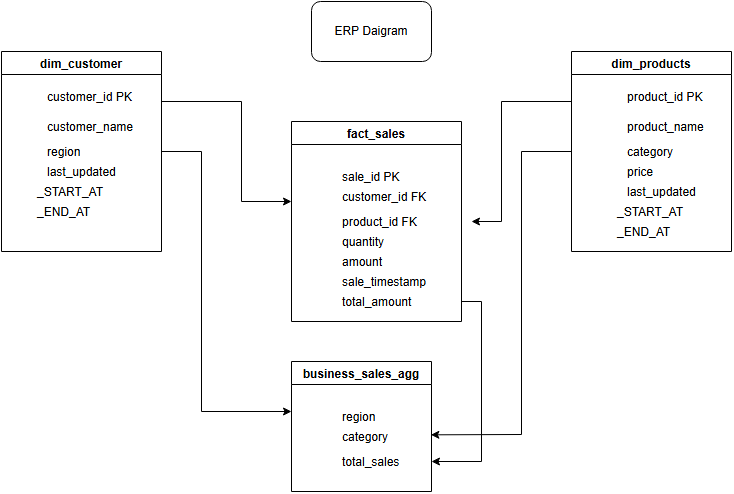
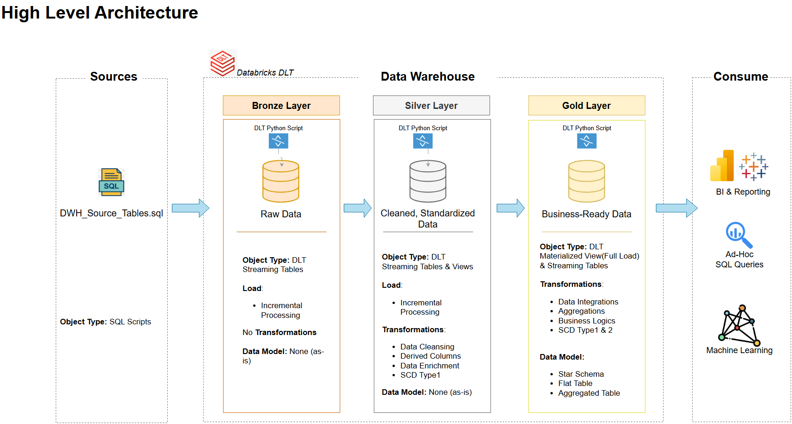

# Data Warehousing with Databricks DLT

## 📖 Project Overview
Welcome to the **DLT Project** repository! 🚀

This project demonstrates how to build a Data Warehouse using Databricks Declarative Live Tables (DLT) pipelines. It showcases key DLT features such as:

- **Flows** for orchestration
- **Streaming tables** for incremental data processing
- **Materialized views** for optimized query performance
- **Views for transformations** and logic abstraction
- **Change Data Capture (CDC)** and **Slowly Changing Dimensions (SCD Types 1 & 2)**

The project also applies the **Medallion Architecture (Bronze, Silver, Gold layers)** to design a structured DWH pipeline.

In addition, detailed **step-by-step documentation** is provided with screenshots, making it easy to follow and understand the design, implementation, and execution of each stage.

## 🚀 Project Requirements

### Building the Data Warehouse (Data Engineering)

#### Objective
Develop a modern data warehouse using DLT Pipelines to consolidate sales data, enabling analytical reporting and informed decision-making.

#### Specifications
- **Data Sources**: Data is imported using SQL queries, which are provided as separate **.sql** files.
- **Data Quality**: Cleanse and resolve data quality issues with Expecations and other industry best practices prior to analysis.
- **Integration**: Combine both sources into a single, user-friendly data model designed for analytical queries.
- **Scope**: Focus on the latest dataset only; historization of data is not required.
- **Documentation**: Provide clear documentation of the data model to support both business stakeholders and analytics teams.

---
---
## 📊 Data Model
The data model for this project follows star schema.



---
## 🏗️ Data Architecture
The data architecture for this project follows Medallion Architecture **Bronze**, **Silver**, and **Gold** layers:


---

## 📂 Repository Structure
```
databricks_declarative_pipelines/
├── docs/                                  # Project documentation and architecture details
│   ├── data_architecture.drawio           # Draw.io file shows the project's architecture
│   ├── Data_Model_ERP_Diagram.png         # .png file for data models (star schema)
│   ├── DLT_Project_Documentation.docx     # End to End documentaion which explains the project briefly

│
├── scripts/                               # DLT Scripts with python for ETL and transformations
│   ├── source/                            # SQL Scripts for source data
│   ├── bronze/                            # Scripts for extracting and loading raw data
│   ├── silver/                            # Scripts for cleaning and transforming data
│   ├── gold/                              # Scripts for creating analytical models

├── README.md                              # Project overview and instructions

```
---
